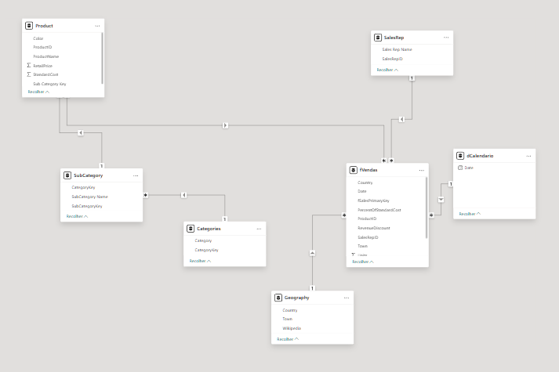
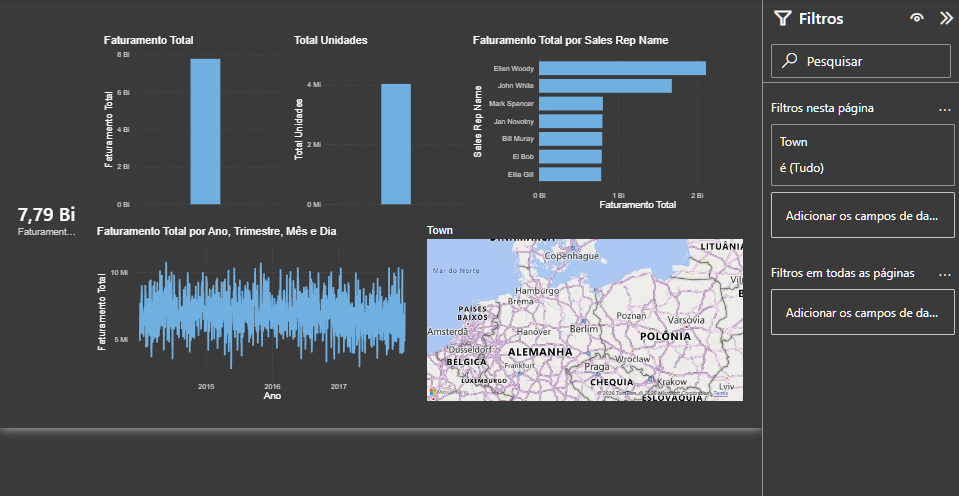

# 📊 Dashboard de Análise de Vendas Globais

## 📝 Sobre o Projeto
Este projeto foi desenvolvido para resolver um problema comum e crítico em negócios internacionais: a fragmentação de dados. O objetivo principal foi centralizar, tratar e modelar informações de vendas espalhadas em diversos arquivos (Excel e CSV) para permitir análises estratégicas ágeis.

**O Desafio:**
A empresa atua em vários países, mas a dispersão dos dados dificultava a visualização de métricas importantes como vendas por região, desempenho de representantes e faturamento por categoria de produto.

**A Solução:**
Através de processos de ETL e modelagem de dados, a base foi transformada e organizada. Foram criadas novas métricas e KPIs utilizando a linguagem DAX, culminando em um dashboard interativo que facilita a extração de insights pelos tomadores de decisão.

## ⚙️ Arquitetura e Modelagem de Dados
Para garantir a performance e escalabilidade do relatório, os dados foram estruturados em um modelo relacional (Star Schema / Snowflake), separando as tabelas fato e dimensão:

* **Tabela Fato:** `fVendas` (Faturamento, custos, descontos)
* **Tabelas Dimensão:** `dCalendario`, `Product`, `Categories`, `SubCategory`, `Geography`, `SalesRep`

## 📈 Visualizações e Funcionalidades
O painel foi construído com foco na experiência do usuário (UX), utilizando um tema escuro para ressaltar as informações e filtros laterais interativos.

**Principais visões:**
* Faturamento Total e Volume de Unidades Vendidas.
* Análise de Desempenho por Representante de Vendas (Sales Rep).
* Série Temporal: Evolução do faturamento ao longo dos anos.
* Geolocalização: Mapa interativo para análise de vendas por país e cidade na Europa.

## 🛠️ Tecnologias e Técnicas Utilizadas
* **Power Query / Linguagem M:** Extração, transformação e carga (ETL) dos arquivos múltiplos.
* **Modelagem de Dados:** Criação de relacionamentos (1:N) e padronização das chaves.
* **Linguagem DAX:** Criação de medidas calculadas para análise de faturamento.
* **Controle de Versão (.pbip):** Este repositório utiliza o formato Power BI Project (`.pbip`), facilitando o controle de versão de metadados e colaboração via Git.

## 🚀 Como executar este projeto
1. Clone este repositório para a sua máquina local.
2. Certifique-se de ter o [Power BI Desktop](https://powerbi.microsoft.com/desktop/) mais recente instalado.
3. Abra o arquivo `analise_vendas_paises.pbip`.
4. (Opcional) Caso o Power BI peça para atualizar a fonte de dados, aponte para a pasta `dados/` incluída neste repositório.
